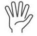
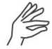
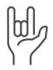
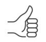
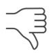

# Hand Gestures with Computer Vision
<text>This repository provides a computer vision solution that recognizes and classifies predefined hand gestures using input data from imaging devices. Our application is designed to enhance presentations and interactions with your computer using intuitive hand gestures.</text>

<div align="center">

•  [Installation](#installation)  •  [Usage](#usage)  •  [Future Applications](#future-applications)  •

</div>

## Problem Statement

With the increasing integration of technology into our daily lives, there is a growing need for more intuitive and natural ways to interact with devices. Hand gestures offer a potential solution for this. Our objective is to build a system that recognises and classifies predefined hand gestures using input data from imaging devices to aid in delivering presentations.


## Key Features

🖐️ **Hand Gesture Detection**: The app leverages advanced computer vision techniques to accurately detect hand gestures in real-time.

🌐 **Interactive Control**: With hand gestures, you can effortlessly control your computer without the need for physical input devices.

✅ **Seamless Actions**: Perform a variety of actions, from adjusting volume to controlling slide presentations, with simple hand gestures.

🚀 **Intuitive Experience**: Enjoy an intuitive and natural way to interact with your computer, making tasks quicker and more enjoyable.


<table class="center" style="border-collapse: collapse; width: 100%; border: 1px solid black;">
  <thead>
    <tr>
      <th align="center" valign="middle" style="border: 1px solid black;">Hand Gesture</th>
      <td align="center" style="border: 1px solid black;"></td>
      <td align="center" style="border: 1px solid black;"></td>
      <td align="center" style="border: 1px solid black;"></td>
      <td align="center" style="border: 1px solid black;"></td>
      <td align="center" style="border: 1px solid black;"></td>
    </tr>
  </thead>
  <tbody>
    <tr>
      <th align="center" valign="middle" style="border: 1px solid black;">Action</th>
      <td align="center" style="border: 1px solid black;">Start Cursor Control</td>
      <td align="center" style="border: 1px solid black;">Hold to Click/ Drag to Draw</td>
      <td align="center" style="border: 1px solid black;">Stop Cursor Control</td>
      <td align="center" style="border: 1px solid black;">Next Slide/ Page Up</td>
      <td align="center" style="border: 1px solid black;">Previous Slide/ Page Down</td>
    </tr>
  </tbody>
</table>


### Folder Structure
```
handsplorers
├── README.md
├── gesture.names
├── images
├── main.py
├── model
│   ├── assets
│   ├── keras_metadata.pb
│   ├── saved_model.pb
│   └── variables
├── requirements.yml
├── src
│   ├── config.py
│   └── handTrackerMod.py
```
## Installation
The `requirements.yml` file will install all required dependencies in a virtual environment
```
conda env create --file requirements.yml
```

<!-- - `openCV == 4.8.1.78`
- `mediapipe == 0.10.7`
- `tensorflow == 2.14.1` -->

## Usage

To use Gesture Control, follow these steps:

1. Run the application in your terminal.
```
python main.py
```

2. Use predefined hand gestures to control actions, such as starting the cursor or changing of slides. Refer to table in the [Key Features](#key-features) section.

### Mouse Control
To switch to Mouse Control mode, do the following:

1. Use the 'stop' gesture to switch to Mouse Control mode.
2. In Mouse Control mode, you can control the mouse cursor using your hand movements.
3. To click on the screen, put your index finger and thumb together. Hold index finger and thumb together to hold click down
4. To switch back to Gesture Control mode, use the 'Rock' gesture.

To customize key bindings and actions, update the [`config.py`](../src/config.py) file.

### Demo
<table>
<tr>
<td>


</td>
<td>


</td>
</tr>
</table>


## Configuration (config.py)
In this project, only 4 gestures were used, the [`config.py`](../src/config.py) file is used to manage key bindings and application settings. To customize your key controls, open the [`config.py`](../src/config.py) file and modify the values according to your preferences.

For example, you can change the key bindings associated with each gesture (except for 'rock' and 'stop'):

```python
# config.py

# Configuration for keystrokes
keystrokes = {
    "call_me": "your_key_binding_here",
    "fist": "your_key_binding_here",
    "live_long": "your_key_binding_here",
    "okay": "your_key_binding_here",
    "peace": "your_key_binding_here",
    "smile": "your_key_binding_here",
    "thumbs_down": "your_key_binding_here",
    "thumbs_up": "your_key_binding_here"
}
```

## Future Applications
- **Real-time Gesture Control**: Implement real-time gesture control for consumer electronics, home automation, and robotics, allowing users to control devices with natural hand movements. (smart homes, drones)
- **Gaming**: Gesture-based controls for immersive gaming experience. Augmented Reality (AR) and Virtual Reality (VR) games.
- **Healthcare**: Surgical training where hand movements are crucial. Monitoring and analyzing hand movements of recovering patients (stroke, spinal cord injury).
- **Sign Language Recognition**: Aids communication for deaf and hard of hearing with real time translation into text or speech.
- **Education**: Interative learning experience, interact with digital whiteboards, manipulate 3D models, and participate in hands-on experiments. 

## Additional Information

The `gesture.names` file contains the gestures that the model was pre-trained on. This means that [`handTrackerMod.py`](../gesture.names) can be customised to work with these gestures.

The pre-trained model was obtained from https://techvidvan.com/tutorials/hand-gesture-recognition-tensorflow-opencv/